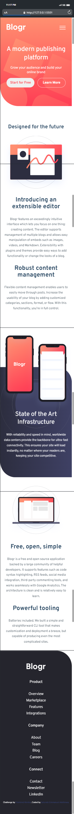
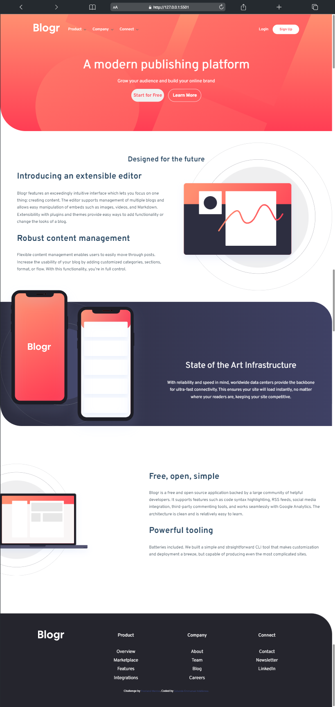

# Frontend Mentor - Blogr landing page solution

This is a solution to the [Blogr landing page challenge on Frontend Mentor](https://www.frontendmentor.io/challenges/blogr-landing-page-EX2RLAApP). Frontend Mentor challenges help you improve your coding skills by building realistic proj
ects.

## Table of contents

- [Overview](#overview)
  - [The challenge](#the-challenge)
  - [Screenshot](#screenshot)
  - [Links](#links)
- [My process](#my-process)
  - [Built with](#built-with)
  - [What I learned](#what-i-learned)
  - [Continued development](#continued-development)
  - [Useful resources](#useful-resources)
- [Author](#author)
- [Acknowledgments](#acknowledgments)

## Overview

### The challenge

Users should be able to:

- View the optimal layout for the site depending on their device's screen size
- See hover states for all interactive elements on the page

### Screenshot

### Links

- Solution URL: [Add solution URL here](https://your-solution-url.com)
- Live Site URL: [Add live site URL here](https://your-live-site-url.com)

## My process

### Built with

- Semantic HTML5 markup
- CSS custom properties
- Flexbox
- CSS Grid
- Mobile-first workflow
- JavaScript

### What I learned

- I went further into CSS Keyframes
- I learnt how to add a background image and also a background color to a div.
- I learnt about how to position images well in a webpage

### Continued development

- CSS Keyframes/Animation

### Useful resources

- [W3 school](https://www.w3schools.com) - This helped me when I was trying to learn more about background color and background image

## Author

- Frontend Mentor - [Manuelcoder02](https://www.frontendmentor.io/profile/Manuelcoder02)
- Twitter - [juniorDev @sotundenuel](https://www.twitter.com/@sotundenuel)
- Instagram -
- Thread -
- Whatsapp -
- Facebook -

## Acknowledgments

A big thank you to myself for getting this project done and also Special thanks to [George](https://twitter.com/_Annonnymouss_) for always taking time to review my works.
